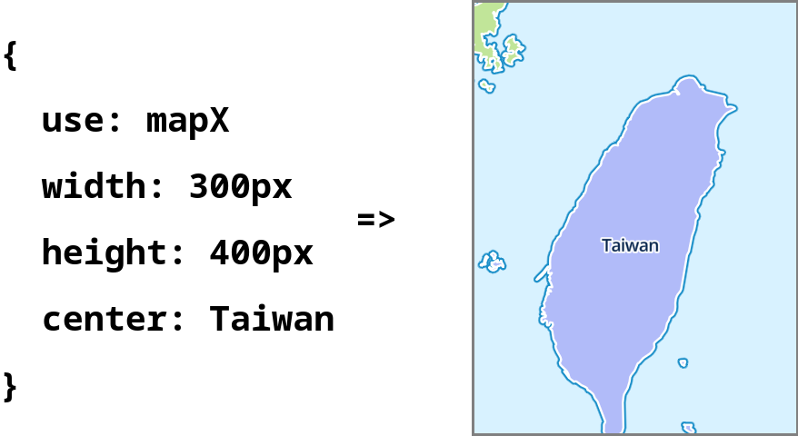

[](https://badge.fury.io/js/mapclay)




MapClay is a JavaScript library that allows you to create interactive maps using simple YAML or JSON configurations. It supports multiple map rendering engines, including Leaflet, Maplibre, and OpenLayers, making it flexible for various use cases.

## Quick Start

### Installation

You can include MapClay in your project using npm:

```bash
npm install mapclay
```

OR use it directly from a CDN. The following examples will go by this way:

```html
<script src='https://unpkg.com/mapclay@latest/dist/mapclay.js'></script>
```

### The minimal use cases

Add script from CDN, and specify **CSS selector** for target HTML element by
- **data attribute** `data-target`
- **query paremeter** `target`

[Try it out](https://markdown-it.github.io/#md3=%7B%22source%22%3A%22%3Cdiv%20id%3D%27map%27%3E%3C%2Fdiv%3E%5Cn%3Cscript%20src%3D%27https%3A%2F%2Funpkg.com%2Fmapclay%40latest%2Fdist%2Fmapclay.js%3Ftarget%3D%2523map%27%3E%3C%2Fscript%3E%5Cn%22%2C%22defaults%22%3A%7B%22html%22%3Atrue%2C%22xhtmlOut%22%3Afalse%2C%22breaks%22%3Afalse%2C%22langPrefix%22%3A%22%22%2C%22linkify%22%3Atrue%2C%22typographer%22%3Afalse%2C%22_highlight%22%3Afalse%2C%22_strict%22%3Afalse%2C%22_view%22%3A%22html%22%7D%7D) with online markdown editor

```html
<!-- Target all <pre> elements -->
<pre></pre>
<script data-target="pre" src='https://unpkg.com/mapclay@latest/dist/mapclay.js'></script>

<!-- Or... -->

<!-- Target all elements with 'id="map"', selector '#map' in URL encoding is '%23map' -->
<div id='map'></div>
<script src='https://unpkg.com/mapclay@latest/dist/mapclay.js?target=%23map'></script>
```

<br>

The text content of target element would be parsed as [YAML](https://nodeca.github.io/js-yaml/#yaml=dXNlOiBNYXBsaWJyZQp3aWR0aDogNDAwcHgKaGVpZ2h0OiA1MHZoCmNlbnRlcjogWzEzOS42OTE3LDM1LjY4OTVdCnpvb206IDgKWFlaOiBodHRwczovL3RpbGUub3BlbnN0cmVldG1hcC5qcC9zdHlsZXMvb3NtLWJyaWdodC81MTIve3p9L3t4fS97eX0ucG5n), So user can specify [options](#options) to configure map.

[Try it out](https://markdown-it.github.io/#md3=%7B%22source%22%3A%22%60%60%60map%5Cnuse%3A%20Leaflet%5Cnwidth%3A%20400px%5Cnheight%3A%2050vh%5Cncenter%3A%20%5B139.6917%2C35.6895%5D%5Cnzoom%3A%208%5CnXYZ%3A%20https%3A%2F%2Ftile.openstreetmap.jp%2Fstyles%2Fosm-bright%2F512%2F%7Bz%7D%2F%7Bx%7D%2F%7By%7D.png%5Cn%60%60%60%5Cn%5Cn%3Cscript%20src%3D%27https%3A%2F%2Funpkg.com%2Fmapclay%40latest%2Fdist%2Fmapclay.js%3Ftarget%3Dpre%27%3E%3C%2Fscript%3E%22%2C%22defaults%22%3A%7B%22html%22%3Atrue%2C%22xhtmlOut%22%3Afalse%2C%22breaks%22%3Afalse%2C%22langPrefix%22%3A%22%22%2C%22linkify%22%3Atrue%2C%22typographer%22%3Afalse%2C%22_highlight%22%3Afalse%2C%22_strict%22%3Afalse%2C%22_view%22%3A%22html%22%7D%7D)

```html
<pre>
use: Maplibre
width: 400px
height: 50vh
center: [139.6917,35.6895]
zoom: 8
XYZ: https://tile.openstreetmap.jp/styles/osm-bright/512/{z}/{x}/{y}.png
</pre>

<script src='https://unpkg.com/mapclay@latest/dist/mapclay.js?target=pre'></script>
```

<br>

All valid target elements would be rendered:

[Try it out](https://markdown-it.github.io/#md3=%7B%22source%22%3A%22%3Cpre%3Euse%3A%20Leaflet%3C%2Fpre%3E%5Cn%3Cpre%3Euse%3A%20Maplibre%3C%2Fpre%3E%5Cn%3Cpre%3Euse%3A%20Openlayers%3C%2Fpre%3E%5Cn%5Cn%3Cscript%20src%3D%27https%3A%2F%2Funpkg.com%2Fmapclay%40latest%2Fdist%2Fmapclay.js%3Ftarget%3Dpre%27%3E%3C%2Fscript%3E%22%2C%22defaults%22%3A%7B%22html%22%3Atrue%2C%22xhtmlOut%22%3Afalse%2C%22breaks%22%3Afalse%2C%22langPrefix%22%3A%22%22%2C%22linkify%22%3Atrue%2C%22typographer%22%3Afalse%2C%22_highlight%22%3Afalse%2C%22_strict%22%3Afalse%2C%22_view%22%3A%22html%22%7D%7D)


```html
<pre>use: Leaflet</pre>
<pre>use: Maplibre</pre>
<pre>use: Openlayers</pre>

<script src='https://unpkg.com/mapclay@latest/dist/mapclay.js?target=pre'></script>
```

<br>

### API calls

If **target** is not given by `<script>` tag, render would not be automatically executed.
Here comes API:

```html
<!DOCTYPE html>
<html lang="en">
<head>
    <title>Play with mapclay</title>
    <meta charset='utf-8'>
    <script src='https://unpkg.com/mapclay@latest/dist/mapclay.js'></script>
</head>
<body>
<pre id="map">
<!-- ...Options here! -->
</pre>
<script>
//...Lets coding!
</script>
</body>
</html>
```

### Render by text content

Still, write text content on target element for options.
And use `mapclay.renderByYaml()` for this case:

[Try it out](https://markdown-it.github.io/#md3=%7B%22source%22%3A%22%3Cscript%20src%3D%27https%3A%2F%2Funpkg.com%2Fmapclay%40latest%2Fdist%2Fmapclay.js%27%3E%3C%2Fscript%3E%5Cn%5Cn%5Cn%3Cpre%20id%3D%27map%27%3E%5Cnuse%3A%20Maplibre%5Cnwidth%3A%20400px%5Cnheight%3A%2050vh%5Cncenter%3A%20%5B139.6917%2C35.6895%5D%5Cn%3C%2Fpre%3E%5Cn%5Cn%5Cn%3Cscript%20defer%3E%5Cnconst%20target%20%3D%20document.querySelector%28%27%23map%27%29%5Cnmapclay.renderByYaml%28target%2C%20target.textContent%29%5Cn%3C%2Fscript%3E%22%2C%22defaults%22%3A%7B%22html%22%3Atrue%2C%22xhtmlOut%22%3Afalse%2C%22breaks%22%3Afalse%2C%22langPrefix%22%3A%22language-%22%2C%22linkify%22%3Atrue%2C%22typographer%22%3Atrue%2C%22_highlight%22%3Atrue%2C%22_strict%22%3Afalse%2C%22_view%22%3A%22html%22%7D%7D)

```html
<!-- In HTML body -->
<pre id="map">
use: Maplibre
width: 400px
height: 50vh
center: [139.6917,35.6895]
</pre>
```

```js
// In <script>
const target = document.querySelector('#map');
mapclay.renderByYaml(target, target.textContent);
```

### Render by config object

Instead of text content, you can manually specify options by config object:

[Try it out](https://markdown-it.github.io/#md3=%7B%22source%22%3A%22%3Cscript%20src%3D%27https%3A%2F%2Funpkg.com%2Fmapclay%40latest%2Fdist%2Fmapclay.js%27%3E%3C%2Fscript%3E%5Cn%5Cn%5Cn%3Cpre%20id%3D%27map%27%3E%3C%2Fpre%3E%5Cn%5Cn%5Cn%3Cscript%20defer%3E%5Cnconsole.log%28mapclay%29%5Cnconst%20target%20%3D%20document.querySelector%28%27%23map%27%29%5Cn%5Cnmapclay.render%28target%2C%20%7B%5Cn%20%20use%3A%20%5C%22Maplibre%5C%22%2C%5Cn%20%20width%3A%20%5C%22400px%5C%22%2C%5Cn%20%20height%3A%20%5C%22400px%5C%22%2C%5Cn%20%20center%3A%20%5B139.6917%2C35.6895%5D%2C%5Cn%20%20zoom%3A%208%2C%5Cn%7D%29%5Cn%3C%2Fscript%3E%22%2C%22defaults%22%3A%7B%22html%22%3Atrue%2C%22xhtmlOut%22%3Afalse%2C%22breaks%22%3Afalse%2C%22langPrefix%22%3A%22language-%22%2C%22linkify%22%3Atrue%2C%22typographer%22%3Atrue%2C%22_highlight%22%3Atrue%2C%22_strict%22%3Afalse%2C%22_view%22%3A%22html%22%7D%7D)

```js
// In <script>
const target = document.querySelector('#map');

mapclay.render(target, {
  use: "Maplibre",
  width: "400px",
  height: "400px",
  center: [139.6917,35.6895],
  zoom: 8,
});
```

<br>

## Options

### Common Options

Except of [special options](#renderer) defines a renderer, there is no mandatory options.

But there are some general optoins come with [default Renderers](#default-renderers):

option|description|value
---|---|---|
id | id of map HTML element | `String`, eg: openlayers
width |  CSS width of map HTML element | `String` for CSS, eg: 100%
height | CSS height of map HTML element | `String` for CSS, eg: 200px
center | Center of map camera | `Array` in [lon, lat], eg: [24, 121]
zoom | Zoom level for map camera | `Number` `0-22`, eg: 12
debug | Show tile boundary | `Boolean`, eg: true
control | Object of control options, supports | `fullscreen: true`, `scale: true`
XYZ | Raster tile URL | `URL` with {x}, {y} and {z}
GPX | GPX file path | `String` for fetchable resource path


### Option: `aliases`

**`object` contains entry for each option**

To improve readability. For each option, specify `aliases` with entries in key-value format:

```yml
# The following config file...
center: [139.6917,35.6895]
zoom: 10

# Is equal to the following:
center: Tokyo
zoom: Metropolitan area
aliases:
  center:
    Tokyo: [139.6917,35.6895]
  zoom:
    Metropolitan area: 10
```

To distinguish an alias from a normal string, each alias starts from **Uppercase Char**. If no value is specified in `aliases`, the original value would be taken.

```yml
# This is an invalid config file

center: tokyo  # Starts from lowercase, this is not an alias nor a valid value for option "center"
GPX: My-track1 # No matched value in aliases.GPX, renderer will use "My-track1" as resource path
aliases:
  center:
    Tokyo: [139.6917,35.6895]
  GPX:
    My-track2: https://example.com/track2.gpx
    My-track3: ./my-track3.gpx
```

If you want to put more information into each alias entry, use `value` to specify its value:

```yml
# The following alias...
aliases:
  center:
    Tykyo: [139.6917,35.6895]

## Is equals to the following:
aliases:
  center:
    Tykyo:
      value: [139.6917,35.6895]
      desc: The biggest city in Japan
```

### Option: `apply`

**`URL` of other config file**

To reuse written config, use `apply` to specify resource path of another config file. Options in current config file are automatically assigned by it.

[Try it out]()

```yml
apply: https://unpkg.com/mapclay/assets/default.yml

# The following alias come from applied config file
center: Delhi
zoom: City
```

### Option: `use`

**`URL` of ES6 module, with Renderer class as default export**

This option specify which [Renderer](#renderer) is used to create a map.

```yml
# Use Renderer with Openlayers by resouece path
use: https://unpkg.com/mapclay/dist/renderers/openlayers.mjs
```

By default, `mapclay.render()` and `mapclay.renderByYaml()` comes with three hidden aliases for default Renderers.

#### Default Renderers

To use default [renderers](#renderer), specify `use` to one of the following aliases:
1. Leaflet
2. Maplibre
3. Openlayers

Check out the [source code](https://github.com/outdoorsafetylab/mapclay/tree/master/src) for each Renderer.

```yml
# Use alias for Renderer in "use" option
use: Openlayers
aliases:
  # The following aliases are hidden by default
  use:
    Leaflet:
      value: renderers/leaflet.mjs,
      description: Leaflet is the leading open-source JavaScript library for mobile-friendly interactive maps. It has all the mapping features most developers ever need.,
    Maplibre:
      value: renderers/maplibre.mjs,
      description: MapLibre GL JS is a TypeScript library that uses WebGL to render interactive maps from vector tiles in a browser. The customization of the map comply with the MapLibre Style Spec.,
    Openlayers:
      value: renderers/openlayers.mjs,
      description: OpenLayers makes it easy to put a dynamic map in any web page. It can display map tiles, vector data and markers loaded from any source. OpenLayers has been developed to further the use of geographic information of all kinds.,
```

## Renderer

In short:

> A Renderer is an Object with 'steps' property, which value is an array of render functions.

For example, this is a minimal valid Renderer Object:

```js
const renderer = {
  steps: [
    function addContent({target}) {
      target.textContent = 'Hello Renderer!'
    }
  ]
}

mapclay.render(element, {
  use: renderer
})
```

`mapclay.render()` probably do the followings behind:
1. Create a new child element with class `mapclay`, it would be assign to `target` property of config file
2. Get Renderer by `use` value in current config file
    * If config file is within `steps`, itself is Renderer
    * If value of `use` is an object within `steps`, take it as Renderer
    * If value of `use` is a valid URL, import it as ES6 module. And use default export as class. Get instance of Renderer by calling `new` operator

    For the second case and third case, all config properties would be applied to Renderer
3. Call each function in `steps` one by one. Function would be bound to Renderer, and Renderer itself is the only argument.
   Like the following:

```js
console.log(renderer.steps) // return [step1, step2, step3...]

// Pesudo code in mapclay.render()
prepareRendering()
  .then(() => step1.call(renderer, renderer))
  .then(() => step2.call(renderer, renderer))
  .then(() => step3.call(renderer, renderer))
  ...
```

With these features, each step function can use destructuring assignment to get arguments to do renderering:

```js
// Get arguments from Renderer Object
function stepXXX({target, width, height}) {
  target.style.width = width + 'px'
  target.style.height = height + 'px'
  ...
}
```


[Default Renderers](#default-renderers) only implements basic features. Create a new one if they don't fit your need. Here is a short example about creating a new custom Renderer Class, which is based on default Renderer `Maplibre`:

```js
import MaplibreRenderer from 'https://unpkg.com/mapclay/dist/renderers/maplibre.mjs'

export default class extends MaplibreRenderer {
  // Override default steps in default class
  get steps() {
    return [...super.steps, this.customStep];
  }

  // Override method createView()
  async customStep({target, customOption}) {
    doSomething(target, customOption)
  }
}
```

Then put the new Renderer into option `use`:

```yml
use: https://path/to/custom-module-with-renderer.mjs
```


## More details

### JSON as text content

Since YAML is a [ superset of JSON ](https://yaml.org/spec/1.2.2/#:~:text=superset%20of%20JSON), user can still write JSON in text content of element:

```html
<pre>
  {
    "use": "Openlayers",
    "center": "Tykyo",
    "zoom": 8
  }
</pre>
```

### Multiple config files

Since YAML docs are separated by `---`, you can render multiple maps at once in a single target element by multiple YAML docs.

[Try it out](https://markdown-it.github.io/#md3=%7B%22source%22%3A%22%60%60%60%5Cnuse%3A%20Leaflet%5Cn---%5Cnuse%3A%20Maplibre%5Cn---%5Cnuse%3A%20Openlayers%5Cn%60%60%60%5Cn%5Cn%3Cscript%20src%3D%27https%3A%2F%2Funpkg.com%2Fmapclay%40latest%2Fdist%2Fmapclay.js%3Ftarget%3Dpre%27%3E%3C%2Fscript%3E%22%2C%22defaults%22%3A%7B%22html%22%3Atrue%2C%22xhtmlOut%22%3Afalse%2C%22breaks%22%3Afalse%2C%22langPrefix%22%3A%22%22%2C%22linkify%22%3Atrue%2C%22typographer%22%3Afalse%2C%22_highlight%22%3Afalse%2C%22_strict%22%3Afalse%2C%22_view%22%3A%22html%22%7D%7D)

```yml
# These are three valid YAML docs

use: Leaflet
---
use: Maplibre
---
use: Openlayers
```

### Run scripts after map is created

Default Renderers use `eval` options for custom scripts, it simply run `eval(VALUE_OF_OPTION)`.

[Try it out](https://markdown-it.github.io/#md3=%7B%22source%22%3A%22%60%60%60map%5Cn%23%20Get%20View%20projection%20from%20ol.Map%2C%20it%20returns%20EPSG%3A3857%20by%20default%5Cnuse%3A%20Openlayers%5Cneval%3A%20console.log%28map.getView%28%29.getProjection%28%29.getCode%28%29%29%5Cn%60%60%60%5Cn%5Cn%3Cscript%20src%3D%27https%3A%2F%2Funpkg.com%2Fmapclay%40latest%2Fdist%2Fmapclay.js%3Ftarget%3Dpre%27%3E%3C%2Fscript%3E%22%2C%22defaults%22%3A%7B%22html%22%3Atrue%2C%22xhtmlOut%22%3Afalse%2C%22breaks%22%3Afalse%2C%22langPrefix%22%3A%22%22%2C%22linkify%22%3Atrue%2C%22typographer%22%3Afalse%2C%22_highlight%22%3Afalse%2C%22_strict%22%3Afalse%2C%22_view%22%3A%22html%22%7D%7D)

```yml
# Get methods in current Renderer
use: Openlayers
eval: console.log(Object.entries(this))
```

```yml
# Get View projection from ol.Map, it returns EPSG:3857 by default
use: Openlayers
eval: console.log(map.getView().getProjection().getCode())
```

Though YAML supports multi-lines string by symbol `>` and `|`, but indent really bothers.

To make it simpler, **if YAML doc is parsed as string, it would be treated as value of `eval` of last YAML doc.**

So the following config...

```yml
# This YAML doc would be parsed as a JSON object
use: Leaflet
eval: |
  console('This is the first YAML doc')
  console('with multi-lines')
  console('string of script')
---
# This YAML doc would be parsed as a JSON object
use: Openlayers
eval: console('This is the second YAML doc')
```

Equals to this... (`;` at end of line matters):

[Try it out](https://markdown-it.github.io/#md3=%7B%22source%22%3A%22%60%60%60%5Cn%23%20This%20YAML%20doc%20would%20be%20parsed%20as%20a%20JSON%20object%5Cnuse%3A%20Leaflet%5Cn---%5Cn%23%20This%20YAML%20doc%20would%20be%20parsed%20as%20String%5Cnconsole%28%27This%20is%20the%20first%20YAML%20doc%27%29%3B%5Cnconsole%28%27with%20multi-lines%27%29%3B%5Cnconsole%28%27string%20of%20script%27%29%3B%5Cn---%5Cn%23%20This%20YAML%20doc%20would%20be%20parsed%20as%20a%20JSON%20object%5Cnuse%3A%20Maplibre%5Cn---%5Cn%23%20This%20YAML%20doc%20would%20be%20parsed%20as%20String%5Cnconsole%28%27This%20is%20the%20second%20YAML%20doc%27%29%3B%5Cn%60%60%60%5Cn%5Cn%3Cscript%20src%3D%27https%3A%2F%2Funpkg.com%2Fmapclay%40latest%2Fdist%2Fmapclay.js%3Ftarget%3Dpre%27%3E%3C%2Fscript%3E%5Cn%22%2C%22defaults%22%3A%7B%22html%22%3Atrue%2C%22xhtmlOut%22%3Afalse%2C%22breaks%22%3Afalse%2C%22langPrefix%22%3A%22language-%22%2C%22linkify%22%3Atrue%2C%22typographer%22%3Atrue%2C%22_highlight%22%3Atrue%2C%22_strict%22%3Afalse%2C%22_view%22%3A%22html%22%7D%7D)

```yml
# This YAML doc would be parsed as a JSON object
use: Leaflet
---
# This YAML doc would be parsed as String
console('This is the first YAML doc');
console('with multi-lines');
console('string of script');
---
# This YAML doc would be parsed as a JSON object
use: Maplibre
---
# This YAML doc would be parsed as String
console('This is the second YAML doc');
```

### Strictly use a default renderer

By default, `mapclay.render()` and `mapclay.renderByYaml()` dynamically import ES6 module by option `use`. It takes time and may fails. If you want to stick to a single Renderer, try to replace script URL with default Renderers:

```html
<!-- Specify Renderer by use option -->
<script src='https://unpkg.com/mapclay/dist/mapclay.js'></script>

<!-- Can only use Renderer comes from the following packages -->
<script src='https://unpkg.com/mapclay/dist/renderers/leaflet.js'></script>
<script src='https://unpkg.com/mapclay/dist/renderers/maplibre.js'></script>
<script src='https://unpkg.com/mapclay/dist/renderers/openlayers.js'></script>
```

## TODOs

- Features
  - Sync map cameras
  - UI components for camera reset
  - Management of layer group
  - Show current Coordinates
  - More aliases
    - XYZ: https://github.com/leaflet-extras/leaflet-providers
  - Supports PMTiles from [ Protomaps ](https://protomaps.com/)
- Style
  - Crosshair at center of map
- Tests for a variety of options

## See Also

- MapML: https://maps4html.org/web-map-doc/
- odyssey.js: http://cartodb.github.io/odyssey.js/
