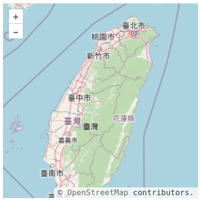
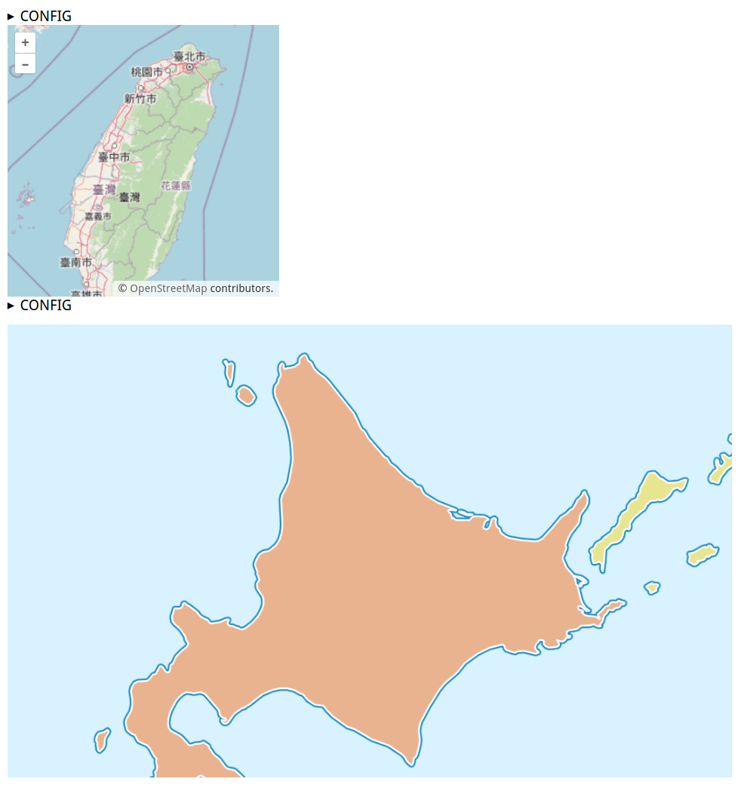

[](https://badge.fury.io/js/mapclay)

## Quick Start

Create an HTML file with the following contents:

```html
<div class="map"></div>
<script type="module" src="https://unpkg.com/mapclay@{VERSION}/js/mapclay.js"></script>
```

`mapclay.js` simply renders elements with `class="map"`(by default) as web map:



Here is another example:

```html
<div class="map"></div>
<pre class="map">
use: maplibre
width: 50vw
height: 500px
center: [142.73, 43.83]
</pre>
<script type="module" src="https://unpkg.com/mapclay@{VERSION}/js/mapclay.js"></script>
```

Here is the result, another map is rendered:



In this case, a new element with `class="map"` is added. Its text is used to configure a map.
`<pre>` is used instead to preserve the newlines in text.

Here we use [maplibre][] as map renderer. The map's width should occupy half of viewport.
And height should be 500px. The center of map is **140.73E 43.83N**.

Each renderer has its own default values.
By default, [maplibre][] use [demotiles][] as its basemap


## Why This?

Modern web maps are developed by many JavaScript libraries.
Many of them are good, have fancy GIS supports and clear documentaion.
But to make a web map with them, adequate frontend knowledge are necessary.

As a hiker and a part-time volunteer of rescue, I have many friends who need to 
create digital maps for a variety of activities. Since most of them are not 
developer, their solutions are *QGIS*, *Garmin BaseCamp* or *Google My-Map/Earth*.
These solutions have better UI, but none of them can fulfill the followings 
at the same time:

1. Easily integrated into a web page
1. Open source solution and no 3rd party service needed
1. Quickly create/modify contents
1. Require minimal GIS/Coding knowledge

In short, **mapclay** is the abstraction for those use cases.

## How it works?

`mapclay.js` only do several things:

1. Use CSS selector (`.map` by default) to get elements about map rendering
1. Parse inner text of each element from YAML format into object. 
1. If object has no property called `use`, assign it by default value.
1. For each `use` value, a coresponding **Renderer** JS class uses 
   `renderMap()` method to render elements into maps.

By default, `mapclay.js` comes with three preinstalled **Renderer** JS [classes][]: 
`openlayers`, `maplibre` and `leaflet`.
Of course each of them use map library with the same name.


## Integration

### hugo

[hugo][] is a popular static site generator. Write markdown files, 
then you get well-organized web pages. Just a little tweak, you can write 
configuration in Code Blocks and get map quickly in generated pages.

Put a [render hook][] file called `render-codeblock-map.html` into `layouts/_default/_markup/`
in your hugo project. With the following contents:

```html
<div>
  <pre class="map">
    {{- .Inner | safeHTML }}
  </pre>
</div>
{{ .Page.Store.Set "hasMap" true }}
```

This override the default markdown rendering behavior of hugo. Now if a markdown
file contains Code Blocks marked `map` like this:

    ```map
    width: 500px
    height: 500px
    center: [142.73, 43.83]
    zoom: 10
    ```

Then this creates a `<pre>` tag and put
codes inside it. Also this marks the web page `hasMap=true` property.

Then in each necessary templates (said `layouts/_default/single.html`),
put the following contents at the end:

```html
{{ if .Page.Store.Get "hasMap" }}
<script type="module" src="https://unpkg.com/mapclay@{VERSION}/js/mapclay.js"></script>
{{ end }}
```

So each page marked `hasMap=ture` would has `mapclay.js` loaded after DOM parsed.
And you get map in your pages.


## Contribution

Since I am not a frontend guy, source code should break some conventions or
need some modern stacks. Feel free to open an issue or PR for what you see.

## See Also

### MapML
https://maps4html.org/web-map-doc/

### odyssey.js
http://cartodb.github.io/odyssey.js/

[maplibre]:     https://maplibre.org/projects/maplibre-gl-js/
[demotiles]:    https://github.com/maplibre/demotiles/
[classes]:      https://github.com/typebrook/mapclay.js/tree/master/js/
[hugo]:         https://gohugo.io/
[render hook]:  https://gohugo.io/templates/render-hooks/
